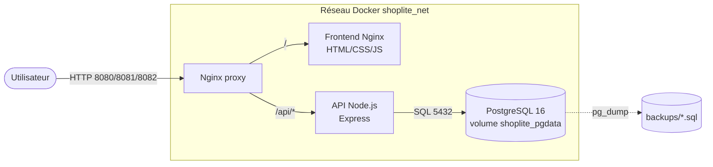
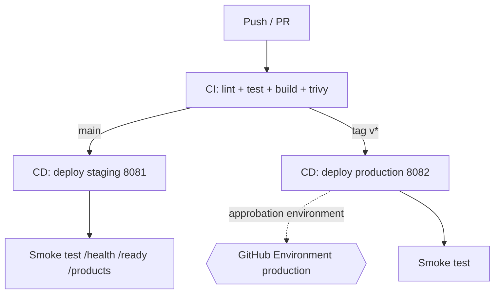

# Architecture ShopLite

## Vue d'ensemble

ShopLite est une mini application e-commerce composée d'un frontend statique, d'une
API Node.js/Express et d'une base PostgreSQL, le tout orchestré par Docker Compose
derrière un reverse proxy Nginx.

## Flux CI/CD

## Composants

| Composant  | Image / techno      | Rôle                                          |
| ---------- | ------------------- | --------------------------------------------- |
| proxy      | nginx:1.27-alpine   | Reverse proxy, route `/` et `/api/*`          |
| frontend   | nginx:1.27-alpine   | Sert le HTML/CSS/JS statique                  |
| api        | node:20-alpine      | API REST `/health` `/ready` `/products`       |
| db         | postgres:16-alpine  | Stockage des produits, volume nommé           |

## Réseau et communication

- Les services communiquent par leur **nom de service** sur le réseau `shoplite_net`.
- L'API joint PostgreSQL via l'hôte `db` (résolution DNS interne Docker), jamais via `localhost`.
- Seul le `proxy` publie un port vers l'hôte ; l'API et la DB ne sont pas exposées en production.

## Persistance

- Volume nommé `shoplite_pgdata` monté sur `/var/lib/postgresql/data`.
- `database/init.sql` initialise le schéma au premier démarrage du volume.
- Les sauvegardes `pg_dump` sont stockées hors conteneur dans `backups/`.
